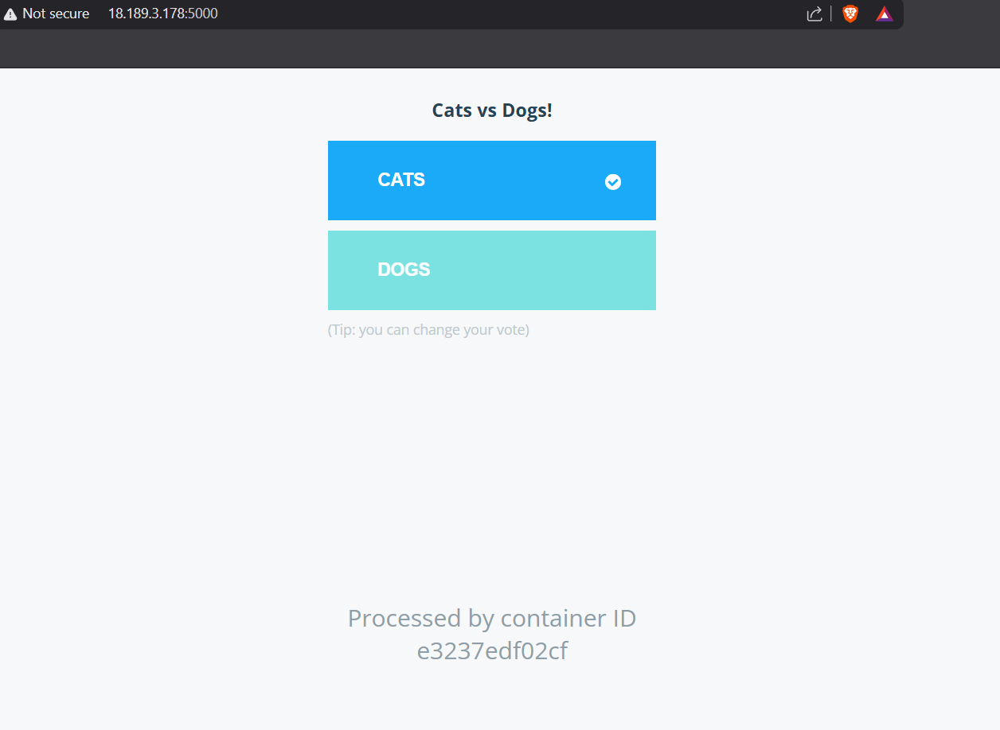
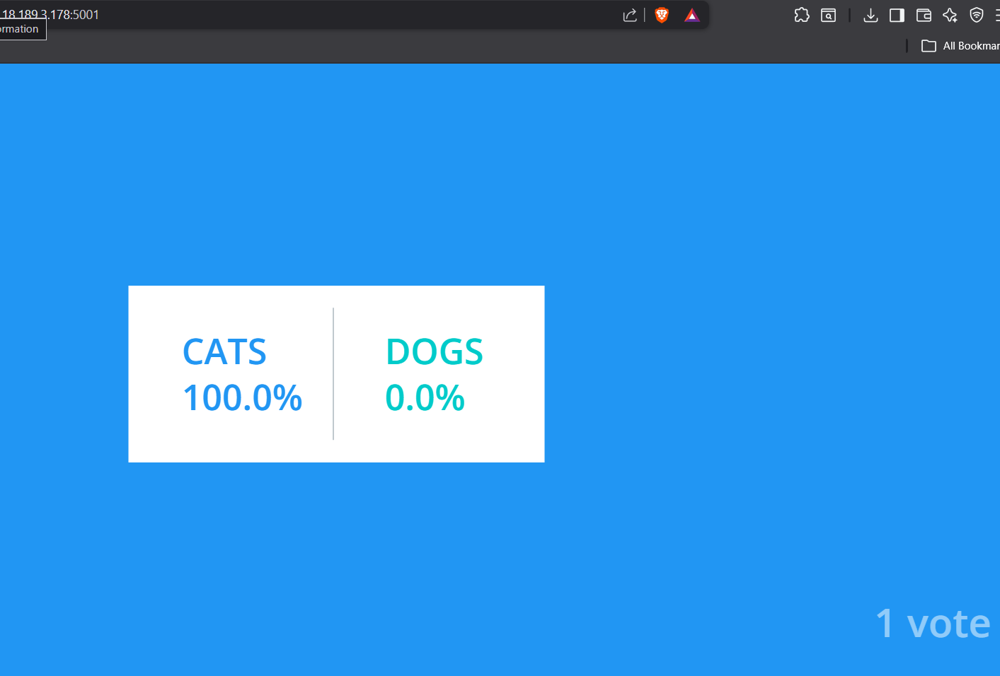
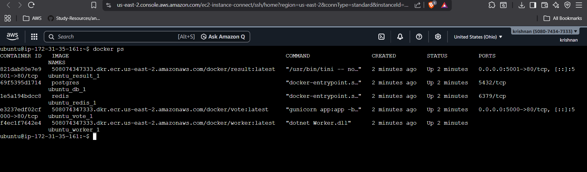

# Docker Voting App

## Project Overview
This is a **multi-container voting application** demonstrating a **production-ready Docker + AWS deployment**.  

The app includes:

- **Vote app** (Python + Flask)  
- **Worker app** (Python + Redis background worker)  
- **Result app** (Node.js + Express)  
- **Redis** (message broker)  
- **PostgreSQL** (database)  

Users can submit votes and view live results. This project showcases **Docker, Docker Compose, ECR, EC2 deployment, and DevOps practices**.

---

## 🖼 Architecture Diagram
```
[Vote App] <---> [Worker] <---> [PostgreSQL]
       |
       v
     [Redis]
       |
       v
[Result App]
```

**Flow Explanation:**

1. User submits vote → handled by **Vote App**.  
2. Vote queued in **Redis**.  
3. **Worker** reads Redis queue and updates **PostgreSQL**.  
4. **Result App** reads database to display live results.

---

## ⚙️ How to Run Locally

1. Clone the repository:

```bash
git clone https://github.com/<your-username>/docker-voting-app.git
cd docker-voting-app
```

2. Build and run containers:

```bash
docker-compose up --build
```

3. Access apps in your browser:

- Voting app → `http://localhost:5000`  
- Result app → `http://localhost:5001`  

---

## ☁️ How to Deploy on AWS EC2

1. Launch Ubuntu EC2 instance.  
2. Install Docker & Docker Compose:

```bash
sudo apt update
sudo apt install docker.io docker-compose -y
sudo usermod -aG docker $USER
logout # and login again
```

3. Configure AWS CLI:

```bash
aws login
```

Enter:

- AWS Access Key ID  
- AWS Secret Access Key  
- Default region: `us-east-2`  
- Output format: `json`  

4. Login to ECR (no sudo):

```bash
aws ecr get-login-password --region us-east-2 \
| docker login --username AWS --password-stdin 508074347333.dkr.ecr.us-east-2.amazonaws.com
```

5. Pull images:

```bash
docker pull 508074347333.dkr.ecr.us-east-2.amazonaws.com/docker/vote:latest
docker pull 508074347333.dkr.ecr.us-east-2.amazonaws.com/docker/worker:latest
docker pull 508074347333.dkr.ecr.us-east-2.amazonaws.com/docker/result:latest
```

6. Create `docker-compose.yml` on EC2 (use ECR images):

```yaml
version: '3'

services:
  redis:
    image: redis

  db:
    image: postgres
    environment:
      POSTGRES_USER: postgres
      POSTGRES_PASSWORD: postgres

  vote:
    image: 508074347333.dkr.ecr.us-east-2.amazonaws.com/docker/vote:latest
    ports:
      - "5000:80"

  worker:
    image: 508074347333.dkr.ecr.us-east-2.amazonaws.com/docker/worker:latest

  result:
    image: 508074347333.dkr.ecr.us-east-2.amazonaws.com/docker/result:latest
    ports:
      - "5001:80"
```

7. Start containers:

```bash
docker-compose up -d
```

8. Access apps in browser using EC2 public IP:

- Voting app → `http://<EC2-PUBLIC-IP>:5000`  
- Result app → `http://<EC2-PUBLIC-IP>:5001`  

---

## 📸 Screenshots

- Voting app UI  
  

- Result app UI  
  

- Docker ps showing running containers  
  


